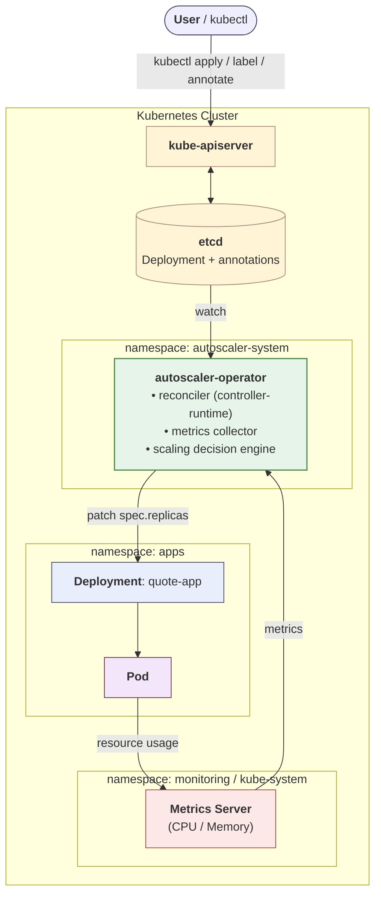
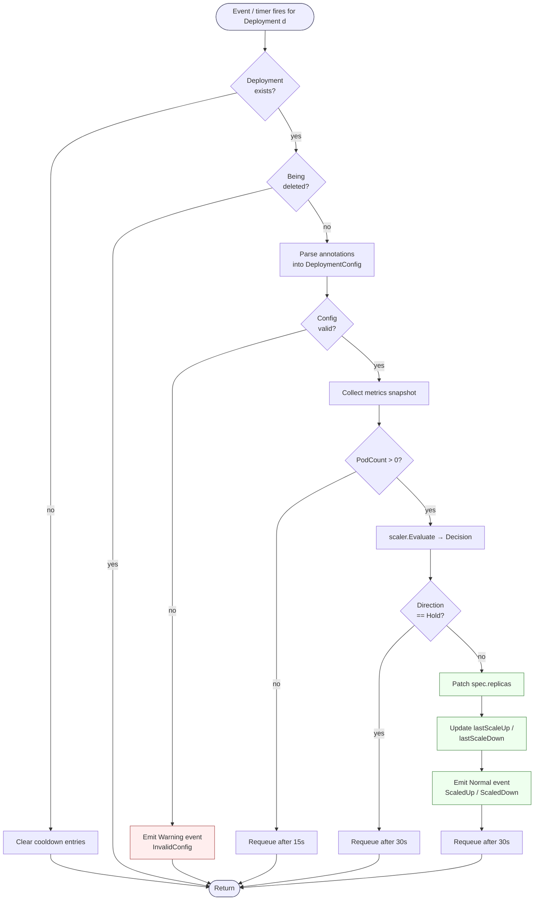

# FIIT-CLOUD — Project Documentation

**Authors:** Peter Farkaš, Darius-Dušan Horvath, Frederik Duvač, Adrián Komanek

---

## 1. Project Goal and Focus

The goal of this project is to design and implement a custom Kubernetes operator, named `autoscaler-operator`, that performs horizontal automatic scaling of containerized applications running on a Kubernetes cluster. Rather than reusing the built-in `HorizontalPodAutoscaler` (HPA) controller, we deliberately build our own implementation so that we can explore the algorithmic core of autoscaling, the integration surface against the Kubernetes API.

The implementation contains all of the moving parts that one would expect from a production-grade Kubernetes operator: a reconciliation loop driven by `controller-runtime`, a label-based watch predicate, a dedicated metrics collector, an isolated pure-function decision engine, and a Helm chart that packages everything together with the appropriate role-based access control.

UPDATE: 
To make the success of the project measurable, we tie the documentation to a concrete experimental goal. When the demo application `quote-app` is subjected to a synthetic HTTP load, the operator must increase the replica count within sixty seconds of the moment the average CPU utilization across all running pods crosses the configured `cpu-scale-up-threshold` of seventy-five percent. Conversely, once the load has subsided and the configured `scale-down-cooldown` of three hundred seconds has elapsed, the operator must return the deployment to its `min-replicas` value. Throughout this entire process the operator must respect the upper and lower replica bounds, and it must not produce visible oscillations in which a scale-up event is immediately followed by a scale-down on the same workload. These four properties together form the measurable goal of the experiment described in Section 6.

---

## 2. Domain Characterization

The project lives in the cloud-native domain and touches three related areas: container orchestration, observability, and elastic scaling. For orchestration we rely on Kubernetes.

For observability the operator reads CPU and memory metrics from the Kubernetes Metrics Server (`metrics.k8s.io`). The cluster also runs `kube-prometheus-stack`, which provides Prometheus and Grafana for visualizing cluster state and load during the experiment.

Elastic scaling itself - the ability to grow and shrink resources in response to demand. We focus on its horizontal version: changing the number of replicas of a stateless workload. The demo application `quote-app` is a small Spring Boot REST service backed by MongoDB; because it is stateless, replicas can be added or removed freely.

On the infrastructure side we use Minikube for local clusters, Terraform for provisioning on the FIIT/SAV OpenStack, and Helm to install every cluster-side component (monitoring stack, demo app, operator) in a reproducible way.

---

## 3. Analysis of Similar Solutions and Differences

Horizontal autoscaling on Kubernetes is not a new problem and several mature solutions already exist. The closest one is the built-in **HPA** (`autoscaling/v2`), which is robust and supports CPU, memory, and custom metrics, but splits the configuration across two objects — the `Deployment` and a separate `HorizontalPodAutoscaler`. We wanted to show that the same effect can be achieved with an annotation-driven model where everything lives on the `Deployment` itself.

**KEDA** extends HPA with event-based scalers (Kafka lag, RabbitMQ queue depth, Prometheus queries). It is more powerful than what we need; writing our own small operator instead lets us expose the control loop and the decision algorithm directly and test them in isolation.

**Cluster Autoscaler** and **Karpenter** also come up in the same conversations, but they scale *nodes*, not pods, so they solve a different problem and would actually complement our operator in a fully equipped cluster.

What sets our solution apart is the combination of five deliberate design choices:

- **Fully label- and annotation-driven.** The user does not need to install any custom resource definitions and does not need to author any additional manifests. The whole scaling policy lives on the deployment it describes.
- **Pure-function scaling algorithm.** The decision logic is a pure Go function with no Kubernetes dependency, which makes it possible to unit-test it without a real or fake cluster and which keeps the rules of the algorithm in a single, easily reviewable file.
- **Conservative scale-down rule.** Scale-down requires a unanimous verdict from all active metrics rather than just one. This trades a small amount of replica savings for visibly improved stability in the face of noisy or weakly correlated signals.
- **Cooldown tracked inside the operator process.** The last scale-up and scale-down timestamps are kept in memory, which avoids the need to serialize that state back into a Kubernetes object and keeps the implementation small.
- **Minimal scope by design.** The operator deliberately does not try to reproduce the full feature surface of HPA, so the project remains a clean illustration of the Kubernetes Operator pattern rather than a second-rate clone of an existing controller.

---

## 4. Concept

### 4.1 Base diagram UPDATE aj sem bude treba pridať REQUESTY

 The diagram below captures, at a glance, the relationship between the user, the Kubernetes API server, etcd, the autoscaler operator, the Metrics Server, the watched deployment, and the pods that ultimately serve user traffic.



Everything inside the outer box runs inside a single Kubernetes cluster. The boxes labeled `namespace: …` show which namespace each component lives in, which matches the runtime layout from the deployment view in the next subsection.

The flow has two main loops:

- **The user → cluster loop (top).** The user issues commands through `kubectl`, which talks to the **kube-apiserver**. The apiserver persists the declared state of every object (including the `Deployment` and its autoscaler annotations) into **etcd**. The user never modifies replica counts manually — they only declare the policy.
- **The autoscaler loop (bottom).** The **autoscaler-operator** watches the apiserver for changes to opted-in `Deployment`s. On every reconciliation tick it collects current CPU and memory usage from the **Metrics Server** (which itself scrapes the pods), runs the decision algorithm, and — when scaling is required — patches `spec.replicas` on the `Deployment`. The Kubernetes scheduler then creates or removes **pods** to match the new desired count.


### 4.2 Architectural views

**Deployment view.** At runtime the cluster contains three functionally separated namespaces:

- `apps` — the demo workload `quote-app` together with its MongoDB instance, provisioned through the Bitnami chart that the application's chart declares as a dependency.
- `autoscaler-system` — the operator itself, deployed as a single-replica `Deployment`. The operator code contains support for leader election, but this feature is disabled by default in the demo, since a single instance is sufficient.
- `monitoring` — the `kube-prometheus-stack` release, which brings in Prometheus, Grafana, Alertmanager, and a set of node and Kubernetes-level exporters. The Metrics Server addon is conceptually part of the monitoring layer too, but by convention it lives in `kube-system`.

The operator communicates with the cluster exclusively through the Kubernetes API server and keeps no durable state outside of it, which makes its lifecycle entirely stateless.

**Process view.** At runtime the operator's behavior is governed by a single reconciliation loop. The loop is fired either by an event from the Kubernetes informer cache, which arrives whenever a watched deployment changes, or by the periodic resync timer whose period is configured through the `--sync-period` flag with a default of thirty seconds. Each iteration proceeds through the following steps:

1. Load the latest version of the deployment from the cache.
2. Parse its annotations into a strongly typed configuration object.
3. Ask the metrics collector for a fresh snapshot of CPU and memory utilization across all pods matching the deployment's selector.
4. Hand both to the pure function `scaler.Evaluate`, which returns a `Decision` (scale up, scale down, or hold).
5. If the decision is to scale, apply a strategic merge patch to `spec.replicas`, emit a Kubernetes `Event`, and update the in-memory cooldown timestamps.
6. Return a `RequeueAfter` hint that schedules the next evaluation, ensuring that the system continues to react even in the absence of external events.

**Component view.** Internally the operator is decomposed into a small number of Go packages, each of which has a single responsibility:

- `cmd/main.go` — bootstraps the operator, parses command-line flags, registers the necessary API schemes, and wires the reconciler into the controller-runtime manager.
- `pkg/controller` — contains all Kubernetes-aware code: the reconciler itself, the parsing and validation of annotation-driven configuration, and the string constants that define the label and annotation keys.
- `pkg/metrics` — encapsulates communication with the `metrics.k8s.io/v1beta1` API and computes percent utilization values from raw usage and request data.
- `pkg/scaler` — contains the pure decision function and is intentionally kept free of any Kubernetes dependency so that it can be tested in isolation.

### 4.3 Technical analysis of the chosen technology UPDATE TOTO JE V POŽIADAVKACH ALE PODLA MŃA BLBOSŤ

The technological foundation of the operator is the Kubernetes Operator pattern, originally described by CoreOS in 2016 and since adopted as the standard way to encode operational knowledge as software inside the Kubernetes ecosystem. At its core, the pattern combines two elements: a resource, which is the declarative object that captures the user's intent, and a controller, which is a long-running process that observes the state of those resources through the watch API and continuously drives the cluster toward the declared desired state. In most operators the resource is a custom resource defined through a `CustomResourceDefinition`, but in our case we deliberately chose to use the existing `Deployment` resource and to attach the operator's configuration to it through a label and a set of annotations. This decision keeps the user-facing model simple and avoids the operational overhead of installing CRDs.

The operator is built on top of the [`controller-runtime`](https://pkg.go.dev/sigs.k8s.io/controller-runtime) library, which is the same library that underpins the kubebuilder framework and a large fraction of the open-source operator ecosystem. Controller-runtime provides several building blocks that are essential for the operator. The *manager* bootstraps the HTTP metrics endpoint, the shared client, and the lifecycle hooks. The *cache* maintains an informer-driven view of cluster state with the configured `SyncPeriod`, which makes it efficient to perform `List` and `Get` operations from the reconciler without overloading the API server. The *predicate* mechanism lets the operator narrow down the set of events it reacts to, which is how the operator restricts itself to deployments that carry the opt-in label `autoscaler.fiit-cloud.io/enabled=true`. Finally, the *builder* ties everything together by registering the reconciler against a concrete resource type, in our case `appsv1.Deployment`.

#### Decision algorithm (`scaler.Evaluate`)

The decision algorithm  is implemented as a single function `scaler.Evaluate` that takes an `Input` struct and returns a `Decision`. The input bundles the current replica count, the timestamps of the last scale-up and scale-down events, the lower and upper replica bounds, the scale step sizes for both directions, the cooldown durations expressed in seconds, the enable flags and percentage thresholds for CPU and memory, and a snapshot of the observed average utilization. The output is a structured value containing the chosen direction (`ScaleUp`, `ScaleDown`, or `Hold`).

The function follows three rules in strict order:

1. **Scale-up** — if at least one active metric has crossed its scale-up threshold, the function attempts to scale up. Two guards apply: if the deployment is already at `MaxReplicas`, or if the scale-up cooldown has not yet elapsed since the last scale-up, the verdict is downgraded to `Hold` and the guard is recorded in the reason list. Otherwise the desired replica count is `min(CurrentReplicas + ScaleUpStep, MaxReplicas)`, which ensures that a single decision cannot push the deployment above its upper bound.
2. **Scale-down** — if no metric is signaling pressure but every active metric is below its scale-down threshold, the function attempts to scale down. The two analogous guards apply: the deployment must not be at `MinReplicas`, and the scale-down cooldown must have elapsed. The desired replica count is `max(CurrentReplicas - ScaleDownStep, MinReplicas)`.
3. **Hold** — in every other case (mixed signals, missing metrics, recent activity within a cooldown window), the function returns `Hold` and the reconciler simply waits for the next cycle.

The unanimous-vote requirement on scale-down is what gives the algorithm its conservative bias and what makes it noticeably less prone to flapping than a naive any-metric-below-threshold rule.


#### Utilization computation

Metrics Server does not directly report utilization as a percentage. Instead, it reports raw CPU usage in millicores and raw memory usage in bytes, and it is up to the consumer of these metrics to compare them against the resource requests declared on each container. Our operator therefore performs the percentage computation itself, in the metrics collector, immediately after fetching the raw data. The CPU utilization is computed as the sum of CPU usage across all running pods divided by the sum of CPU requests across the same set of containers, multiplied by one hundred. The memory utilization is computed in an analogous way, using the byte counts reported by the Metrics Server and the byte counts declared in the pod specs.

```
avgCPU%   = Σ (pod CPU usage milli)        / Σ (container CPU requests milli)        * 100
avgMem%   = Σ (pod Memory usage bytes)     / Σ (container Memory requests bytes)     * 100
```

Several edge cases are handled explicitly:

- Pods not in the `Running` phase are skipped entirely, since their resource accounting is not yet meaningful.
- Pods that are running but whose metrics have not yet been published by the Metrics Server are also skipped, which prevents the snapshot from being skewed by a freshly started replica that has not yet stabilized.
- If a container has no `resources.requests` field set, the percentage computation has no denominator; in that case the snapshot value is set to `-1`, which serves as a sentinel that marks the metric as inactive. The decision algorithm interprets this sentinel correctly and simply excludes the inactive metric from the decision, which means that a workload declaring only a CPU request will still be scaled correctly based on CPU alone.

---

## 5. Technical Description of the Implementation

### 5.1 Solution boundaries

The current version of the operator deliberately leaves out the following:

- **CRD-driven configuration.** Scaling policy lives in annotations on the `Deployment`, not in a dedicated `CustomResourceDefinition`.
- **Vertical scaling.** Requests and limits of containers are not adjusted.
- **Other workload kinds.** Only `Deployment` resources are scaled; `StatefulSet`, `DaemonSet`, and friends are out of scope.
- **SLO on reaction time.** The upper bound on responsiveness is determined by `--sync-period` (default 30 s); the operator makes no harder guarantee.
- **True active-active HA.** Leader election is wired into the code but is disabled by default in the demo; running a multi-replica operator would require additional conflict-avoidance work.

The solution also makes two explicit assumptions about the environment in which it runs:

- The cluster has a working Metrics Server. Without it the metrics collector has no data to work with and the operator simply holds the current replica count.
- The workload being scaled has `resources.requests` set for both CPU and memory. Without them the percentage computation has no denominator and the operator treats the affected metric as inactive.

Both assumptions are easy to satisfy in a typical cluster and are explicitly verified during the setup procedure and are both considered best practice for running Kubernetes.

### 5.2 The autoscaler-operator component


#### Key types

The operator is built around a small number of types:

- **`controller.DeploymentReconciler`** — implements `reconcile.Reconciler` from controller-runtime. Holds the Kubernetes client, the metrics collector, and two in-memory maps (`scaleUpTimes`, `scaleDownTimes`) keyed by namespace/name. These maps enable cooldown enforcement without persisting state outside the operator's process.
- **`controller.DeploymentConfig`** — populated by `ParseDeploymentConfig`. Reads annotations with safe defaults and enforces three invariants: `MaxReplicas` must be set, `MinReplicas ≤ MaxReplicas`, and for each metric the scale-down threshold must be strictly less than the scale-up threshold. Violations cause a Kubernetes warning event and skipped reconciliation until the user fixes the configuration.
- **`metrics.Collector`** — facade over the controller-runtime client (used to list pods) and a versioned metrics client (for `metrics.k8s.io/v1beta1`).
- **`metrics.DeploymentSnapshot`** — the aggregated reading: `PodCount`, `AvgCPUUtilizationPct`, `AvgMemUtilizationPct`, with `-1` marking inactive metrics.
- **`scaler.Input` / `scaler.Decision` / `scaler.Direction`** — the input/output schema of the pure decision function; intentionally free of any Kubernetes dependency.

#### Annotation-based configuration

From the user's point of view, opting a workload into autoscaling is a matter of setting a single label and a small number of annotations on the deployment. The label `autoscaler.fiit-cloud.io/enabled` must be set to the literal string `"true"`; any other value, or the absence of the label, will cause the predicate in the operator's watch configuration to filter the deployment out, and no reconciliation will take place. Once the label is set, the user can fine-tune the operator's behavior by setting a number of annotations. Sensible defaults are provided for every annotation except `max-replicas`, which is required because there is no reasonable default for an upper bound on replica count.

```yaml
metadata:
  labels:
    autoscaler.fiit-cloud.io/enabled: "true"
```

The full set of annotations recognized by the operator is summarized in the following table. All keys are prefixed with `autoscaler.fiit-cloud.io/`; the prefix is omitted from the table for brevity.

| Annotation | Default | Meaning |
|---|---|---|
| `min-replicas` | `1` | lower replica bound |
| `max-replicas` | **required** | upper replica bound |
| `scale-up-step` | `1` | replicas added per scale-up |
| `scale-down-step` | `1` | replicas removed per scale-down |
| `scale-up-cooldown` | `60` (s) | minimum interval between scale-up events |
| `scale-down-cooldown` | `300` (s) | minimum interval between scale-down events |
| `cpu-enabled` | `true` | whether CPU is taken into account |
| `cpu-scale-up-threshold` | `80` (%) | CPU scale-up threshold |
| `cpu-scale-down-threshold` | `20` (%) | CPU scale-down threshold |
| `mem-enabled` | `true` | whether memory is taken into account |
| `mem-scale-up-threshold` | `80` (%) | memory scale-up threshold |
| `mem-scale-down-threshold` | `20` (%) | memory scale-down threshold |

#### Reconciliation lifecycle (pseudocode)

The reconciliation loop combines all of the pieces discussed so far. When the controller-runtime framework fires the reconciler for a particular deployment, the loop proceeds through a fixed sequence of step. It fetches the deployment, handles the case in which the deployment has been deleted or is being deleted, parses and validates the configuration, asks the metrics collector for a fresh snapshot, hands the snapshot to the pure decision function, applies the resulting patch if any, updates the in-memory cooldown bookkeeping, and finally returns a requeue hint that schedules the next iteration. 

The flowchart below captures the sequence; the actual implementation in `pkg/controller/reconciler.go` follows the same shape with added error handling and logging.



### 5.3 Step-by-step setup of the whole system

The setup procedure below describes the full path that brings up the cluster, installs the monitoring stack, deploys the demo application, installs the operator, and enables autoscaling on the demo workload. The procedure assumes a Linux, macOS, or Windows machine with the usual developer tooling available, including `bash`, `make`, `git`, and Docker Desktop; on Windows the procedure has also been verified inside WSL.

#### Step 1 — Clone the repository

The repository is hosted on GitHub and can be obtained through a regular `git clone`. All subsequent commands are issued from inside the cloned directory. Or you can used files zip file from assignement.

```bash
git clone https://github.com/K-o-m-A/fiit-cloud.git
cd fiit-cloud
```

#### Step 2 — Install tooling

The local-cluster directory contains a cross-platform Makefile that detects the host operating system and downloads the appropriate binaries for Minikube, `kubectl`, and Helm. Running `make install` from this directory is enough to obtain the entire toolchain. The Makefile is idempotent and skips downloads when the tools are already installed.

```bash
cd local-cluster
make install
```

#### Step 3 — Start the local cluster

The Makefile is also responsible for starting the Minikube cluster. The default profile, called `fiit-cloud`, is configured with four CPU cores and four gigabytes of memory, which is sufficient to run the monitoring stack, the demo application, and the operator side by side. Minikube automatically enables the `metrics-server` addon during cluster creation, which is essential for the operator's metrics collector.

```bash
make start-cluster
```

#### Step 4 — Deploy the monitoring stack

With the cluster up and running, the next step is to install the `kube-prometheus-stack` Helm release into the `monitoring` namespace. The stack brings in Prometheus, Grafana, Alertmanager, the kube-state-metrics exporter, and the node exporter. Grafana is exposed through the Minikube tunnel and can be opened with a single command; a separate target prints the default admin credentials.

```bash
make install-prometheus-stack
make grafana-open
make grafana-creds
```

#### Step 5 — Deploy the demo application (`quote-app`)

The demo application is installed through its own Helm chart, which lives in `quote-app/helm/quote-app`. The chart pulls in the Bitnami MongoDB sub-chart as a dependency, so a single `make install-quote-app` invocation provisions both the application and its database in the `apps` namespace.

```bash
make install-quote-app
```

#### Step 6 — Deploy the autoscaler operator

The operator is itself packaged as a Helm chart and is installed into the `autoscaler-system` namespace. The chart creates a dedicated service account, a cluster role with the minimum permissions required by the operator, and a cluster role binding that ties them together. The operator's deployment template renders a single-replica deployment by default.

```bash
make install-autoscaler-operator
```

#### Step 7 — Enable autoscaling on `quote-app`

The final configuration step is to opt the `quote-app` deployment into autoscaling by setting the appropriate label and annotations. Both operations are expressed as standard `kubectl` commands. The thresholds used here are deliberately on the lower end of the sensible range so that simple experiment can be done with a modest amount of load.

```bash
kubectl label deployment quote-app -n apps \
    autoscaler.fiit-cloud.io/enabled=true --overwrite

kubectl annotate deployment quote-app -n apps \
    autoscaler.fiit-cloud.io/min-replicas=1 \
    autoscaler.fiit-cloud.io/max-replicas=5 \
    autoscaler.fiit-cloud.io/scale-up-step=1 \
    autoscaler.fiit-cloud.io/scale-down-step=1 \
    autoscaler.fiit-cloud.io/cpu-enabled=true \
    autoscaler.fiit-cloud.io/cpu-scale-up-threshold=75 \
    autoscaler.fiit-cloud.io/cpu-scale-down-threshold=25 \
    autoscaler.fiit-cloud.io/mem-enabled=true \
    autoscaler.fiit-cloud.io/mem-scale-up-threshold=80 \
    autoscaler.fiit-cloud.io/mem-scale-down-threshold=60 \
    --overwrite
```

#### Step 8 — Verification

Once the deployment is labeled and annotated, the operator's reconciler immediately begins to evaluate it. The current replica count, the operator's log output, and the Kubernetes events generated by the operator are the three primary observability surfaces; together they make it easy to confirm that the system is behaving as expected.

```bash
kubectl get deploy quote-app -n apps -w
kubectl logs -n autoscaler-system deploy/autoscaler-operator -f
kubectl get events -n apps --field-selector reason=ScaledUp,reason=ScaledDown
```

#### Alternative — OpenStack (SAV)

The configuration creates a private network, a subnet, a router, a security group with the rules required by Kubernetes, ports for the control-plane and the worker, two virtual machines (one for the control plane and one for the worker), and a floating IP that exposes the API server. Bootstrap scripts initialize the control plane with `kubeadm init`, join the worker, and fetch the kubeconfig file locally so that `kubectl` can be used against the cluster from the operator's machine.

```bash
cd openstack/terraform
terraform init
terraform plan
terraform apply
export KUBECONFIG=~/.kube/openstack-k8s.conf
kubectl get nodes
```

At the time of writing, the SAV OpenStack environment exhibits slow disk I/O that causes the `kubeadm init` step to fail intermittently, which is why the project is primarily demonstrated on a local Minikube cluster.
---

## 6. Experiment UPDATE - UPRAVIŤ AJ V3ETKY TEXTY O EXPERIMENTE


### 6.5 Observations and discussion

Beyond the numeric metrics, the experiment also provides qualitative insight into how the operator behaves under load. By tailing the operator's log in real time, one can read off the precise reason that triggered each scaling decision: each log line emitted at scale-up or scale-down time contains a serialized `Decision` that lists the metrics involved, the observed values, and the thresholds that were crossed. Kubernetes events recorded on the deployment provide a more durable trail of the same information and can be retrieved at any time with `kubectl describe deploy quote-app -n apps`. Together, the log and the event stream are sufficient to reconstruct the entire history of an experiment and to diagnose any unexpected behavior.

UPDATE = PRIDAŤ NIEČO O EXPERIMENTE
