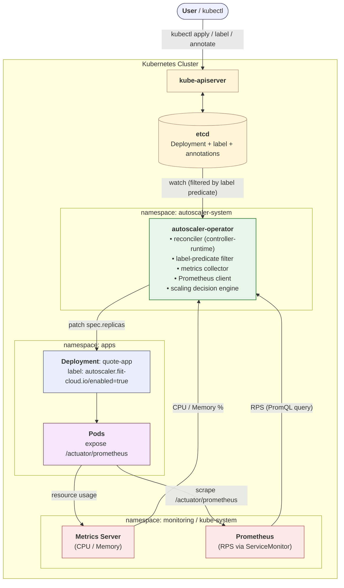

# FIIT-CLOUD - Project Documentation

**Authors:** Peter Farkaš, Darius-Dušan Horvath, Frederik Duvač, Adrián Komanek

---

## 1. Project Goal and Focus

The goal of this project is to design and implement a custom Kubernetes operator, named `autoscaler-operator`, that performs horizontal automatic scaling of containerized applications running on a Kubernetes cluster. Rather than reusing the built-in `HorizontalPodAutoscaler` (HPA) controller, we deliberately build our own implementation so that we can explore the algorithmic core of autoscaling, the integration surface against the Kubernetes API.

The implementation contains all of the parts that one would expect from a production-grade Kubernetes operator: a reconciliation loop driven by `controller-runtime`, a label-based watch predicate, a dedicated metrics collector, an isolated pure-function decision engine, and a Helm chart that packages everything together with the appropriate role-based access control.

To make the success of the project measurable, we tie the documentation to a concrete experimental goal. The operator supports three independent scaling signals - CPU utilisation, memory utilisation, and per-pod requests per second (RPS) - that can be enabled in any combination through annotations on the watched `Deployment`. When the demo application `quote-app` is subjected to a synthetic HTTP load, the operator must increase the replica count within sixty seconds of the moment the active scaling metric crosses its configured scale-up threshold. Conversely, once the load has subsided and the configured `scale-down-cooldown` has elapsed, the operator must return the deployment to its `min-replicas` value. Throughout this entire process the operator must respect the upper and lower replica bounds, and it must not produce visible oscillations in which a scale-up event is immediately followed by a scale-down on the same workload. These four properties together form the measurable goal of the experiment described in Section 6.

### 1.1 Project work distribution

When working on this project, we divided the work as follows:

- **Adrián Komanek** - infrastructure and packaging. Owned the cross-platform `local-cluster/Makefile`, the Terraform stack for the FIIT/SAV OpenStack environment, and and Helm charts.
- **Darius-Dušan Horvath** - backend application and database. Authored the Spring Boot `quote-app` service, designed the MongoDB schema and the Mongock seed migration.
- **Frederik Duvač and Peter Farkaš** - Go operator. Jointly implemented the `autoscaler-operator` codebase: the controller-runtime reconciler, the annotation-driven configuration model and the metrics collector.

Documentation, integration testing, and the experiment in Section 6 were carried out jointly.

---

## 2. Domain Characterization

The project lives in the cloud-native domain and touches three related areas: container orchestration, observability, and elastic scaling. For orchestration we rely on Kubernetes.

For observability the operator combines two data sources. CPU and memory utilisation come from the Kubernetes Metrics Server (`metrics.k8s.io`), which aggregates kubelet/cadvisor readings on a thirty-second cycle. Per-pod request rate comes from `kube-prometheus-stack`, which scrapes the demo application's `/actuator/prometheus` endpoint through a `ServiceMonitor` shipped with the `quote-app` Helm chart. Grafana, also part of the same stack, is used for visualising cluster state and load during the experiment.

Elastic scaling itself - the ability to grow and shrink resources in response to demand. We focus on its horizontal version: changing the number of replicas of a stateless workload. The demo application `quote-app` is a small Spring Boot REST service backed by MongoDB; because it is stateless, replicas can be added or removed freely.

On the infrastructure side we use Minikube for local clusters, Terraform for provisioning on the FIIT/SAV OpenStack, and Helm to install every cluster-side component (monitoring stack, demo app, operator) in a reproducible way.

---

## 3. Analysis of Similar Solutions and Differences

Horizontal autoscaling on Kubernetes is not a new problem and several mature solutions already exist. The closest one is the built-in **HPA** (`autoscaling/v2`), which is robust and supports CPU, memory, and custom metrics, but splits the configuration across two objects - the `Deployment` and a separate `HorizontalPodAutoscaler`. We wanted to show that the same effect can be achieved with an annotation-driven model where everything lives on the `Deployment` itself.

**KEDA** extends HPA with event-based scalers (Kafka lag, RabbitMQ queue depth, Prometheus queries). It is more powerful than what we need; writing our own small operator instead lets us expose the control loop and the decision algorithm directly and test them in isolation.

**Cluster Autoscaler** and **Karpenter** also come up, but they scale *nodes*, not pods, so they solve a different problem and would actually complement our operator in a fully equipped cluster.

What sets our solution apart is the combination of six deliberate design choices:

- **Fully driven by labels and annotations.** The user does not need to install any custom resource definitions and does not need to author any additional manifests. The whole scaling policy lives on the deployment it describes.
- **Application-level signal in addition to resource signals.** Beyond CPU and memory, the operator can scale on per-pod request rate queried from Prometheus. This makes it suitable for HTTP services where traffic is a more useful signal than the resource pressure it eventually causes. CPU, memory and RPS are independent - any combination of them can be enabled per workload.
- **Pure-function scaling algorithm.** The decision logic is a pure Go function with no Kubernetes dependency, which makes it possible to unit-test it without a real or fake cluster and which keeps the rules of the algorithm in a single, easily reviewable file.
- **Conservative scale-down rule.** Scale-down requires a unanimous verdict from all active metrics rather than just one. This trades a small amount of replica savings for visibly improved stability in the face of noisy or weakly correlated signals.
- **Cooldown tracked inside the operator process.** The last scale-up and scale-down timestamps are kept in memory, which avoids the need to serialize that state back into a Kubernetes object and keeps the implementation small.
- **Minimal scope by design.** The operator deliberately does not try to reproduce the full feature surface of HPA, so the project remains a clean illustration of the Kubernetes Operator pattern rather than a second-rate clone of an existing controller.

---

## 4. Concept

### 4.1 Base diagram

The diagram below captures, the relationship between the user, the Kubernetes API server, etcd, the autoscaler operator, the two metric sources (Metrics Server for CPU/memory and Prometheus for request rate), the watched deployment, and the pods that ultimately serve user traffic.



Everything inside the outer box runs inside a single Kubernetes cluster. The boxes labeled `namespace:` show which namespace each component lives in, which matches the runtime layout from the deployment view in the next subsection.

The flow has three main loops:

- **The user → cluster loop (top).** The user issues commands through `kubectl`, which talks to the **kube-apiserver**. The apiserver persists the declared state of every object (including the `Deployment`, its opt-in label, and its autoscaler annotations) into **etcd**. The user never modifies replica counts manually - they only declare the policy.
- **The resource-metrics loop (left).** Each pod's kubelet exposes per-container CPU and memory usage; the **Metrics Server** aggregates those readings cluster-wide every thirty seconds. On every reconciliation tick the operator's metrics collector queries `metrics.k8s.io` and converts the raw usage into percentages of the pod's declared `resources.requests`.
- **The application-metrics loop (right).** Each `quote-app` pod exposes a Prometheus-format counter `http_server_requests_seconds_count` on `/actuator/prometheus`. A `ServiceMonitor` shipped with the `quote-app` chart registers the pods with `kube-prometheus-stack`, which scrapes them every fifteen seconds. On every reconciliation tick the operator issues an instant PromQL query to Prometheus and obtains the per-pod request rate averaged across replicas.

The **autoscaler-operator** combines whichever of these three signals are enabled for the workload, runs the decision algorithm (Section 4.3), and - when scaling is required patches `spec.replicas` on the `Deployment`. The Kubernetes scheduler then creates or removes pods to match the new desired count.

Crucially, **the operator never sees a `Deployment` unless it carries the label `autoscaler.fiit-cloud.io/enabled=true`.** A controller-runtime *predicate* filters the watch stream at the source, so any deployment without the label is invisible to the reconciler and costs zero CPU cycles. This is the entire opt-in mechanism: setting a label enrols a workload; removing it un-enrols it.


### 4.2 Architectural views

**Deployment view.** 

At runtime the cluster contains three functionally separated namespaces:

- `apps` - the demo workload `quote-app` together with its MongoDB instance, provisioned through the Bitnami chart that the application's chart declares as a dependency.
- `autoscaler-system` - the operator itself, deployed as a single-replica `Deployment`. The operator code contains support for leader election, but this feature is disabled by default.
- `monitoring` - the `kube-prometheus-stack` release, which brings in Prometheus, Grafana, Alertmanager, and a set of node and Kubernetes-level exporters. The Metrics Server addon is conceptually part of the monitoring layer too, but by default it lives in `kube-system`.

The operator communicates with the cluster exclusively through the Kubernetes API server and keeps no durable state outside of it, which makes its lifecycle entirely stateless.

**Process view.** 

At runtime the operator's behavior is governed by a single reconciliation loop. The loop is fired either by an event from the Kubernetes informer cache or by the periodic resync timer whose period is configured through the `--sync-period` flag with a default of 30 seconds. Each iteration proceeds through the following steps:

1. Load the latest version of the deployment from the cache.
2. Parse its annotations into a typed configuration object.
3. Ask the metrics collector for a fresh snapshot. The collector populates three fields: CPU and memory utilisation (from Metrics Server) and per-pod request rate (from Prometheus, if the `--prometheus-url` flag is set). Each field uses the sentinel value `-1` when its source is unavailable or the corresponding metric is disabled.
4. Hand the snapshot to the pure function `scaler.Evaluate`, which returns a `Decision` (scale up, scale down, or hold).
5. If the decision is to scale, apply a strategic merge patch to `spec.replicas`, emit a Kubernetes `Event`, and update the in-memory cooldown timestamps.
6. Return a `RequeueAfter` hint that schedules the next evaluation, ensuring that the system continues to react even in the absence of external events.

**Component view.** 

Internally the operator is decomposed into a small number of Go packages, each of which has a single responsibility:

- `cmd/main.go` - bootstraps the operator, parses command-line flags, registers the necessary API schemes, and wires the reconciler into the controller-runtime manager.
- `pkg/controller` - contains all Kubernetes-aware code: the reconciler itself, the parsing and validation of annotation-driven configuration, the label-predicate function used by the watch builder, and the string constants that define the label and annotation keys.
- `pkg/metrics` - encapsulates communication with the `metrics.k8s.io/v1beta1` API, computes percent utilisation values from raw usage and request data, and orchestrates the RPS query against Prometheus.
- `pkg/prometheus` - a minimal HTTP client for the Prometheus instant-query API (`/api/v1/query`). Used by the metrics collector to fetch per-pod request rate.
- `pkg/scaler` - contains the pure decision function and is intentionally kept free of any Kubernetes dependency so that it can be tested in isolation.

### 4.3 Technical analysis of the chosen technology

#### Labeling mechanism - how a workload is discovered

The operator does not poll the API server for a list of deployments to scale. Instead, controller-runtime is configured to *watch* the `apps/v1/Deployment` type cluster-wide and to invoke `Reconcile` only when a configured *predicate* returns true. The predicate is a single-line Go function defined in `pkg/controller/reconciler.go`:

```go
labelSelector := predicate.NewPredicateFuncs(func(obj client.Object) bool {
    v, ok := obj.GetLabels()[LabelEnabled]
    return ok && v == "true"
})
```

`LabelEnabled` is the constant `autoscaler.fiit-cloud.io/enabled`. A `Deployment` that does not carry this label, or carries it with any value other than `"true"`, is dropped at the source. This has three practical consequences:

1. **Opt-in is explicit.** The operator never scales a workload its owner did not enroll. Removing the label immediately removes the workload from the reconcile queue.
2. **Cluster-wide cost is bounded.** The watch stream is filtered before any business logic runs, so adding an unlabeled deployment costs nothing for the operator.
3. **Configuration lives with the workload.** Because the label is on the `Deployment` itself, the scaling policy moves, is backed up, and is deleted together with the workload. There is no separate `HorizontalPodAutoscaler` object to keep in sync, as there is with stock HPA.


#### Decision algorithm (`scaler.Evaluate`)

The decision algorithm is implemented as a single function `scaler.Evaluate` that takes an `Input` struct and returns a `Decision`. The input bundles the current replica count, the timestamps of the last scale-up and scale-down events, the lower and upper replica bounds, the scale step sizes for both directions, the cooldown durations in seconds, the enable flag and thresholds for each of the three metrics - CPU utilisation, memory utilisation, and per-pod RPS and a snapshot of the observed values. The output is a structured value containing the chosen direction (`ScaleUp`, `ScaleDown`, or `Hold`), the proposed new replica count, and a list of `Reason` records that explain why this direction was chosen.

A metric is considered *active* in a given reconcile cycle if and only if both of the following hold: the user enabled it through the corresponding `*-enabled` annotation, and the collector successfully obtained a value (i.e. the snapshot field is not the sentinel `-1`). An inactive metric does not vote either way. This lets the operator degrade gracefully. If Prometheus is unreachable, the RPS field drops to `-1`, RPS becomes inactive, and the decision proceeds on CPU and memory alone.

The function then follows three rules in strict order:

1. **Scale-up** - if at least one active metric has crossed its scale-up threshold, the function attempts to scale up. Two guards apply: if the deployment is already at `MaxReplicas`, or if the scale-up cooldown has not yet elapsed since the last scale-up, the verdict is downgraded to `Hold` and the guard is recorded in the reason list. Otherwise the desired replica count is `min(CurrentReplicas + ScaleUpStep, MaxReplicas)`, which ensures that a single decision cannot push the deployment above its upper bound. The asymmetry here is deliberate: even a single overheating metric is enough to trigger growth, because the cost of withholding capacity under load is greater than the cost of an extra pod.
2. **Scale-down** - if no metric is signaling upward pressure and *every* active metric is below its scale-down threshold , the function attempts to scale down. The two analogous guards apply: the deployment must not be at `MinReplicas`, and the scale-down cooldown must have elapsed. The desired replica count is `max(CurrentReplicas - ScaleDownStep, MinReplicas)`.
3. **Hold** - in every other case - mixed signals, no active metrics, recent activity within a cooldown window, the function returns `Hold` and the reconciler simply waits for the next cycle.


#### Utilisation computation (CPU and memory)

Metrics Server does not directly report utilization as a percentage. Instead, it reports raw CPU usage in millicores and raw memory usage in bytes, and it is up to the consumer of these metrics to compare them against the resource requests declared on each container. Our operator therefore performs the percentage computation itself, in the metrics collector, immediately after fetching the raw data. The CPU utilization is computed as the sum of CPU usage across all running pods divided by the sum of CPU requests across the same set of containers, multiplied by one hundred. The memory utilization is computed in an analogous way, using the byte counts reported by the Metrics Server and the byte counts declared in the pod specs.

```
avgCPU%   = Σ (pod CPU usage milli)        / Σ (container CPU requests milli)        * 100
avgMem%   = Σ (pod Memory usage bytes)     / Σ (container Memory requests bytes)     * 100
```

Several edge cases are handled explicitly:

- Pods not in the `Running` phase are skipped entirely, since their resource accounting is not yet meaningful.
- Pods that are running but whose metrics have not yet been published by the Metrics Server are also skipped, which prevents the snapshot from being skewed by a freshly started replica that has not yet stabilized.
- If a container has no `resources.requests` field set, the percentage computation has no denominator; in that case the snapshot value is set to `-1`, which serves as a sentinel that marks the metric as inactive. The decision algorithm interprets this sentinel correctly and simply excludes the inactive metric from the decision, which means that a workload declaring only a CPU request will still be scaled correctly based on CPU alone.

#### Request-rate computation (RPS)

CPU and memory describe the *resource pressure* that load creates. For HTTP services, the load itself is usually a more useful and faster signal. The operator therefore supports a third metric, the average per-pod request rate, queried directly from Prometheus.

For this to work, the application has to expose a Prometheus-format counter. The `quote-app` chart enables Spring Boot's `actuator` together with the Micrometer Prometheus registry, which makes the standard counter `http_server_requests_seconds_count` available on the application's HTTP port at `/actuator/prometheus`. A `ServiceMonitor` shipped with the chart registers each pod with `kube-prometheus-stack`, which scrapes the endpoint every fifteen seconds.

On every reconcile tick the metrics collector composes the following instant query (`namespace` and `deploymentName` come from the watched object):

```
avg(sum by (pod) (rate(http_server_requests_seconds_count{namespace="<NS>",pod=~"<DEP>-.*"}[1m])))
```

---

## 5. Technical Description of the Implementation

### 5.1 Solution boundaries

The current version of the operator deliberately leaves out the following:

- **CRD-driven configuration.** Scaling policy lives in annotations on the `Deployment`, not in a dedicated `CustomResourceDefinition`.
- **Vertical scaling.** Requests and limits of containers are not adjusted.
- **Other workload kinds.** Only `Deployment` resources are scaled; `StatefulSet`, `DaemonSet`, and friends are out of scope.
- **SLO on reaction time.** The upper bound on responsiveness is determined by `--sync-period` (default 30 s); the operator makes no harder guarantee.
- **True active-active HA.** Leader election is wired into the code but is disabled by default in the demo; running a multi-replica operator would require additional conflict-avoidance work.

The solution also makes three explicit assumptions about the environment in which it runs:

- The cluster has a working Metrics Server. Without it the CPU and memory snapshot fields drop to `-1` and the operator falls back to whichever other metrics are active; if no metric is active it simply holds the current replica count.
- The workload being scaled has `resources.requests` set for both CPU and memory. Without them the percentage computation has no denominator and the operator treats the affected metric as inactive.
- For RPS-based scaling, the cluster runs Prometheus reachable at the URL passed via the operator's `--prometheus-url` flag, and the workload exposes a counter `http_server_requests_seconds_count` that Prometheus scrapes. 
 
All three assumptions are easy to satisfy in a typical cluster and are explicitly verified during the setup procedure. First two are also considered best practice for running Kubernetes.

### 5.2 The autoscaler-operator component


#### Key types

The operator is built around a small number of types:

- **`controller.DeploymentReconciler`** - implements `reconcile.Reconciler` from controller-runtime. Holds the Kubernetes client, the metrics collector, and two in-memory maps (`scaleUpTimes`, `scaleDownTimes`) keyed by namespace/name. These maps enable cooldown enforcement without persisting state outside the operator's process.
- **`controller.DeploymentConfig`** - populated by `ParseDeploymentConfig`. Reads annotations with safe defaults and enforces four invariants: `MaxReplicas` must be set, `MinReplicas ≤ MaxReplicas`, and for each of the three metrics (CPU, memory, RPS) the scale-down threshold must be strictly less than the scale-up threshold. Violations cause a Kubernetes warning event and skipped reconciliation until the user fixes the configuration.
- **`metrics.Collector`** - facade over the controller-runtime client (used to list pods), the versioned metrics client (for `metrics.k8s.io/v1beta1`), and an optional Prometheus client. When the Prometheus client is `nil` the collector simply leaves `AvgRPS` at `-1`.
- **`metrics.DeploymentSnapshot`** - the aggregated reading: `PodCount`, `AvgCPUUtilizationPct`, `AvgMemUtilizationPct`, `AvgRPS`. The integer `-1` is reserved as a sentinel meaning "this metric is inactive in this cycle" and is recognised by the decision algorithm.
- **`prometheus.Client`** - thin HTTP client built on the Go standard library that issues instant `/api/v1/query` requests against the configured Prometheus endpoint and parses the scalar response.
- **`scaler.Input` / `scaler.Decision` / `scaler.Direction`** - the input/output schema of the pure decision function; intentionally free of any Kubernetes dependency. `Input` carries enable flags and thresholds for all three metrics; `Decision` carries the chosen direction, the proposed new replica count, and a slice of `Reason` records explaining the verdict.

#### Annotation-based configuration

From the user's point of view, opting a workload into autoscaling is a matter of setting a single label and a small number of annotations on the deployment. The label `autoscaler.fiit-cloud.io/enabled` must be set to the literal string `"true"`. Any other value, or the absence of the label, will cause the predicate in the operator's watch configuration to filter the deployment out, and no reconciliation will take place. Once the label is set, the user can fine-tune the operator's behavior by setting a number of annotations. Sensible defaults are provided for every annotation except `max-replicas`, which is required because there is no reasonable default for an upper bound on replica count.

```yaml
metadata:
  labels:
    autoscaler.fiit-cloud.io/enabled: "true"
```

The full set of annotations recognized by the operator is summarized in the following table. All keys are prefixed with `autoscaler.fiit-cloud.io/`; the prefix is omitted from the table for brevity.

| Annotation                 | Default       | Meaning                                                                                                                |
| -------------------------- | ------------- | ---------------------------------------------------------------------------------------------------------------------- |
| `min-replicas`             | `1`           | lower replica bound                                                                                                    |
| `max-replicas`             | **required**  | upper replica bound                                                                                                    |
| `scale-up-step`            | `1`           | replicas added per scale-up                                                                                            |
| `scale-down-step`          | `1`           | replicas removed per scale-down                                                                                        |
| `scale-up-cooldown`        | `60` (s)      | minimum interval between scale-up events                                                                               |
| `scale-down-cooldown`      | `300` (s)     | minimum interval between scale-down events                                                                             |
| `cpu-enabled`              | `true`        | whether CPU is taken into account                                                                                      |
| `cpu-scale-up-threshold`   | `80` (%)      | CPU scale-up threshold (percentage of CPU request)                                                                     |
| `cpu-scale-down-threshold` | `20` (%)      | CPU scale-down threshold (percentage of CPU request)                                                                   |
| `mem-enabled`              | `true`        | whether memory is taken into account                                                                                   |
| `mem-scale-up-threshold`   | `80` (%)      | memory scale-up threshold (percentage of memory request)                                                               |
| `mem-scale-down-threshold` | `20` (%)      | memory scale-down threshold (percentage of memory request)                                                             |
| `rps-enabled`              | `false`       | whether per-pod request rate is taken into account (opt-in; requires the operator's `--prometheus-url` flag to be set) |
| `rps-scale-up-threshold`   | `100` (req/s) | RPS scale-up threshold (average requests per second per pod)                                                           |
| `rps-scale-down-threshold` | `10` (req/s)  | RPS scale-down threshold (average requests per second per pod)                                                         |

#### Reconciliation lifecycle (pseudocode)

The reconciliation loop combines all of the pieces discussed so far. When the controller-runtime framework fires the reconciler for a particular deployment, the loop proceeds through a fixed sequence of step. It fetches the deployment, handles the case in which the deployment has been deleted or is being deleted, parses and validates the configuration, asks the metrics collector for a fresh snapshot, hands the snapshot to the pure decision function, applies the resulting patch if any, updates the in-memory cooldown bookkeeping, and finally returns a requeue hint that schedules the next iteration. 

The flowchart below captures the sequence; the actual implementation in `pkg/controller/reconciler.go` follows the same shape with added error handling and logging.


### 5.3 Backend application `quote-app` and MongoDB

The application is a Spring Boot 3.4 service running on Java 21. It exposes a single business endpoint, `GET /quote`, which selects one document from the `quotes` MongoDB collection uniformly at random and returns it as JSON in the shape `{"value": "<text>"}`. The whole code base is intentionally minimal - a `QuoteController`, a `QuoteService`, a Spring Data `QuoteRepository`, and a `Quote` entity annotated with `@Document(collection = "quotes")` - so that the resource cost per request is dominated by HTTP and JSON handling rather than by application logic. This keeps the relationship between request rate, CPU usage, and memory usage predictable, which is important when interpreting the autoscaler's behavior.

Beyond the business endpoint, the service exposes the Spring Boot Actuator endpoints `/actuator/health`, `/actuator/info`, and `/actuator/prometheus`. The first two drive the Kubernetes startup, liveness, and readiness probes defined in the chart, all of which hit `/actuator/health`. The third is the key integration point with the rest of the monitoring stack: it is served by `micrometer-registry-prometheus` and publishes the standard Spring Boot HTTP metric `http_server_requests_seconds_count`, tagged with `application=mudro-dna-be` so that it can be filtered cleanly in Prometheus queries.

The application's most important pom dependencies are:

| Dependency                                                          | Role                                         |
| ------------------------------------------------------------------- | -------------------------------------------- |
| `spring-boot-starter-web`                                           | REST endpoint, embedded Tomcat               |
| `spring-boot-starter-data-mongodb`                                  | Spring Data repository support for MongoDB   |
| `spring-boot-starter-actuator`                                      | health, info, and prometheus endpoints       |
| `micrometer-registry-prometheus`                                    | Prometheus exposition of HTTP metrics        |
| `io.mongock:mongock-springboot-v3` + `mongodb-springdata-v4-driver` | versioned database migrations                |
| `org.projectlombok:lombok`                                          | boilerplate elimination on entities and DTOs |

All MongoDB connection parameters are read from environment variables (`MONGODB_HOST`, `MONGODB_PORT`, `MONGODB_DATABASE`, `MONGODB_USERNAME`, `MONGODB_PASSWORD`, `MONGODB_AUTH_DB`), which the Helm chart injects into the pod from the `app.mongodb.*` keys in `values.yaml`. The application itself stores no secrets in its image.

#### 5.3.2 The MongoDB backing store

The database itself is deliberately simple. A single database named `quote` holds a single collection named `quotes`. Each document has only two fields, an `_id` of type ObjectId and a `quote` field of type string. The schema is described in code by the `Quote` entity:

```java
@Document(collection = "quotes")
public class Quote {
    @Id private String id;
    private String quote;
}
```

Because the chart sets `replicaCount: 1` on the MongoDB sub-chart, there is no replica set and no sharding; this matches the project's focus on stateless-workload scaling rather than on database elasticity.

### 5.4 Step-by-step setup of the whole system
The setup procedure below describes the full path that brings up the cluster, installs the monitoring stack, deploys the demo application, installs the operator, and enables autoscaling on the demo workload. The procedure assumes a Linux, macOS, or Windows machine with the usual developer tooling available, including `bash`, `make`, `git`, and Docker Desktop; on Windows the procedure has also been verified inside WSL.

#### Step 1 - Clone the repository

The repository is hosted on GitHub and can be obtained through a regular `git clone`. All subsequent commands are issued from inside the cloned directory. Or you can use files from the ZIP archive.

```bash
git clone https://github.com/K-o-m-A/fiit-cloud.git
cd fiit-cloud
```

#### Step 2 - Install tooling

The local-cluster directory contains a cross-platform Makefile that detects the host operating system and downloads the appropriate binaries for Minikube, `kubectl`, and Helm. Running `make install` from this directory is enough to obtain the entire toolchain. The Makefile is idempotent and skips downloads when the tools are already installed.

```bash
cd local-cluster
make install
```

#### Step 3 - Start the local cluster

The Makefile is also responsible for starting the Minikube cluster. The default profile, called `fiit-cloud`, is configured with four CPU cores and four gigabytes of memory, which is sufficient to run the monitoring stack, the demo application, and the operator side by side. Minikube automatically enables the `metrics-server` addon during cluster creation, which is essential for the operator's metrics collector.

```bash
make start-cluster
```

#### Step 4 - Deploy the monitoring stack

With the cluster up and running, the next step is to install the `kube-prometheus-stack` Helm release into the `monitoring` namespace. The stack brings in Prometheus, Grafana, Alertmanager, the kube-state-metrics exporter, and the node exporter. Grafana is exposed through the Minikube tunnel and can be opened with a single command; a separate target prints the default admin credentials.

```bash
make install-prometheus-stack
make grafana-open
make grafana-creds
```

#### Step 5 - Deploy the demo application (`quote-app`)

The demo application is installed through its own Helm chart, which lives in `quote-app/helm/quote-app`. The chart pulls in the Bitnami MongoDB sub-chart as a dependency, so a single `make install-quote-app` invocation provisions both the application and its database in the `apps` namespace. The chart additionally renders a `ServiceMonitor` resource, which registers the application's `/actuator/prometheus` endpoint with `kube-prometheus-stack`. From that point on, Prometheus scrapes the application every fifteen seconds and the request-rate metric becomes available to the operator's Prometheus query.

```bash
make install-quote-app
```

#### Step 6 - Deploy the autoscaler operator

The operator is itself packaged as a Helm chart and is installed into the `autoscaler-system` namespace. The chart creates a dedicated service account, a cluster role with the minimum permissions required by the operator, and a cluster role binding that ties them together. The operator's deployment template renders a single-replica deployment by default. The chart's `values.yaml` exposes the Prometheus endpoint through `controller.prometheusUrl` (default `http://prometheus-stack-kube-prom-prometheus.monitoring.svc.cluster.local:9090`), which is passed to the operator binary as the `--prometheus-url` flag; leaving it empty disables RPS-based scaling cluster-wide regardless of the per-workload `rps-enabled` annotation.

```bash
make install-autoscaler-operator
```

#### Step 7 - Enable autoscaling on `quote-app`

The final configuration step is to opt the `quote-app` deployment into autoscaling by setting the appropriate label and annotations. Both operations are expressed as standard `kubectl` commands. The thresholds used here are deliberately on the lower end of the sensible range so that simple experiment can be done with a modest amount of load.

```bash
kubectl label deployment quote-app -n apps \
    autoscaler.fiit-cloud.io/enabled=true --overwrite

kubectl annotate deployment quote-app -n apps \
    autoscaler.fiit-cloud.io/min-replicas=1 \
    autoscaler.fiit-cloud.io/max-replicas=5 \
    autoscaler.fiit-cloud.io/scale-up-step=1 \
    autoscaler.fiit-cloud.io/scale-down-step=1 \
    autoscaler.fiit-cloud.io/cpu-enabled=true \
    autoscaler.fiit-cloud.io/cpu-scale-up-threshold=75 \
    autoscaler.fiit-cloud.io/cpu-scale-down-threshold=25 \
    autoscaler.fiit-cloud.io/mem-enabled=true \
    autoscaler.fiit-cloud.io/mem-scale-up-threshold=80 \
    autoscaler.fiit-cloud.io/mem-scale-down-threshold=60 \
    --overwrite
```

#### Step 8 - Verification

Once the deployment is labeled and annotated, the operator's reconciler immediately begins to evaluate it. The current replica count, the operator's log output, and the Kubernetes events generated by the operator are the three primary observability surfaces; together they make it easy to confirm that the system is behaving as expected.

```bash
kubectl get deploy quote-app -n apps -w
kubectl logs -n autoscaler-system deploy/autoscaler-operator -f
kubectl get events -n apps --field-selector reason=ScaledUp,reason=ScaledDown
```

#### Alternative - OpenStack (SAV)

The configuration creates a private network, a subnet, a router, a security group with the rules required by Kubernetes, ports for the control-plane and the worker, two virtual machines (one for the control plane and one for the worker), and a floating IP that exposes the API server. Bootstrap scripts initialize the control plane with `kubeadm init`, join the worker, and fetch the kubeconfig file locally so that `kubectl` can be used against the cluster from the operator's machine.

```bash
cd openstack/terraform
terraform init
terraform plan
terraform apply
export KUBECONFIG=~/.kube/openstack-k8s.conf
kubectl get nodes
```

At the time of writing, the SAV OpenStack environment exhibits slow disk I/O that causes the `kubeadm init` step to fail intermittently, which is why the project is primarily demonstrated on a local Minikube cluster.

---

## 6. Experiment

### 6.1 Experiment 1 - Scaling based on requests per second

This experiment exercises the operator in its RPS-only configuration. CPU and memory signals are explicitly disabled (`cpu-enabled=false`, `mem-enabled=false`), so the only input that can move `spec.replicas` is the per-pod request rate observed by Prometheus. The goal is to demonstrate that the operator reacts to traffic itself rather than to any second-order resource pressure it might cause, which is the property that distinguishes our implementation from the stock HPA in its default CPU-only mode.

#### 6.1.1 Goal and pass criteria

The experiment is considered successful when all four properties below hold:

1. The replica count increases within sixty seconds of the moment the per-pod RPS crosses the configured `rps-scale-up-threshold`.
2. Once load is removed and the configured `scale-down-cooldown` elapses, the replica count returns to `min-replicas=1`.
3. The replica count never leaves the `[min-replicas, max-replicas] = [1, 5]` interval.
4. No oscillation occurs - a scale-up is never immediately followed by a scale-down on the same workload while load is still present.

#### 6.1.2 Setup

The operator is configured through annotations on the `quote-app` deployment in the `apps` namespace. The thresholds are deliberately low so that a single `busybox` load generator is enough to push the system past the scale-up threshold:

| Annotation                                  | Value              |
| ------------------------------------------- | ------------------ |
| `min-replicas`                              | `1`                |
| `max-replicas`                              | `5`                |
| `scale-up-step` / `scale-down-step`         | `1` / `1`          |
| `scale-up-cooldown` / `scale-down-cooldown` | `30 s` / `60 s`    |
| `cpu-enabled`                               | `false`            |
| `mem-enabled`                               | `false`            |
| `rps-enabled`                               | `true`             |
| `rps-scale-up-threshold`                    | `10` req/s per pod |
| `rps-scale-down-threshold`                  | `2` req/s per pod  |

Per-pod RPS is computed from the application's own `http_server_requests_seconds_count` counter, scraped every fifteen seconds by `kube-prometheus-stack` through the `ServiceMonitor` shipped with the `quote-app` chart. The operator queries Prometheus with:

```promql
avg(sum by (pod) (rate(http_server_requests_seconds_count{namespace="apps",pod=~"quote-app-.*"}[1m])))
```

The whole procedure is automated by `requestLoadTest.sh` in the repository root, which configures the annotations, drives the load generator, polls Prometheus, and prints a timestamped trace to `rps-experiment-<timestamp>.log`.

#### 6.1.3 Running the experiment

The experiment is launched with a single shell script and does not require any in-cluster cooperation beyond a port-forward into Prometheus, which is the channel through which the script reads the RPS metric. The full sequence from a freshly installed cluster is:

```bash
# 1. Make Prometheus reachable on http://localhost:9090
kubectl port-forward -n monitoring svc/prometheus-stack-kube-prom-prometheus 9090:9090 &

# 2. Run the experiment from the repository root
./requestLoadTest.sh
```

The script writes the same trace it prints to stdout into a file named `rps-experiment-YYYYMMDD-HHMMSS.log` in the current directory, and the path is echoed in the final summary block. Re-running the scripts overwrites the annotations on `quote-app`, deletes any leftover `load-gen` pod from a previous run, and starts from a clean baseline. A `trap` on exit removes the load generator even when the script is interrupted, so a partial run will not leave artificial traffic flowing.

Two optional knobs are available without editing the script:

- `PROM_URL` - override the Prometheus endpoint, useful when the port-forward is bound to a different local port. Example: `PROM_URL=http://localhost:9091 ./requestLoadTest.sh`.
- The autoscaler annotations applied by the script can be tightened or relaxed beforehand with `kubectl annotate deployment quote-app -n apps ...`; subsequent invocations of the script will overwrite them, so any custom values should be re-applied between runs.

While the script is executing it is informative to open two extra terminals, one tailing the operator log and one watching the deployment, to correlate the script's RPS samples with the operator's `scaling decision` entries and the resulting replica changes:

```bash
kubectl logs -n autoscaler-system deploy/autoscaler-operator -f | grep -E "scaling decision|scaled up|scaled down"
kubectl get deploy quote-app -n apps -w
```

#### 6.1.4 Procedure

The script proceeds through five phases:

1. **Preflight** - confirm the deployment exists and that Prometheus is reachable at `http://localhost:9090` (the port-forward into the `monitoring` namespace).
2. **Baseline (30 s)** - record replica count and RPS with no synthetic load. Background RPS comes only from the in-cluster Spring Boot actuator probe traffic and should be a small fraction of one request per second.
3. **Apply load** - start a single `busybox` pod that hits `http://quote-app:8080/quote` in a tight loop and wait for it to become Ready.
4. **Watch scale-up (max 180 s)** - sample replicas and RPS every ten seconds until the deployment either reaches `max-replicas=5` or the deadline elapses; record the time of the first scale-up event.
5. **Stop load and watch scale-down (max 600 s)** - delete the load generator and continue sampling until replicas drop back to `min-replicas=1`.

#### 6.1.5 Results

The trace below was produced with the patched operator on a fresh `fiit-cloud` Minikube cluster. Only the rows where the replica count changes are shown.

| Phase      | t (s)  | Replicas  | Avg RPS / pod | Event                          |
| ---------- | ------ | --------- | ------------- | ------------------------------ |
| Baseline   | 0 → 21 | 1         | ≈ 0.2         | -                              |
| Scale-up   | 10     | 1         | 149.7         | RPS crosses scale-up threshold |
| Scale-up   | **20** | **1 → 2** | 517.3         | **first scale-up**             |
| Scale-up   | 51     | 2 → 3     | 701.0         | scale-up cooldown elapsed      |
| Scale-up   | 81     | 3 → 4     | 163.7         | scale-up cooldown elapsed      |
| Scale-up   | 112    | 4 → 5     | 128.8         | reached `max-replicas`         |
| Load off   | -      | 5         | -             | load generator deleted         |
| Scale-down | 60     | 5 → 4     | 0.2           | RPS below scale-down threshold |
| Scale-down | 121    | 4 → 3     | 0.3           | scale-down cooldown elapsed    |
| Scale-down | 197    | 3 → 2     | 0.3           | scale-down cooldown elapsed    |
| Scale-down | 257    | 2 → 1     | 0.3           | back to `min-replicas`         |

The four pass criteria from Section 6.1.1 are all met:

- **Reaction time** - first scale-up occurred 20 s after load was applied, well under the 60 s budget.
- **Return to baseline** - replicas dropped from 5 back to 1 in 257 s once load was removed, gated by the 60 s scale-down cooldown between each step (5→4→3→2→1, four steps × ≈ 60 s = ≈ 240 s plus initial detection lag).
- **Bounds respected** - replica count stayed within `[1, 5]` throughout; the operator stopped at 5 even while RPS remained high.
- **No oscillation** - scale-up events occurred only while load was present and scale-down events only after it was removed; the directions never reversed within a single phase.

#### 6.1.6 Discussion

A few qualitative observations are worth recording. The first is that the per-pod RPS visibly *decreases* as replicas are added - from ≈ 700 req/s per pod at two replicas down to ≈ 130 req/s per pod at five,because the same client load is being spread across more pods by the Kubernetes service. This is the behavior that justifies measuring *per-pod* rather than *total* RPS: the scale-up threshold is a property of a single pod's capacity, and the scale-down threshold fires correctly once the load is gone regardless of how many pods existed at that moment.

The second observation concerns the scale-down trajectory. With a sixty-second `scale-down-cooldown` and a step size of one, scaling from five back to one takes at least four cooldown windows - the observed 257 s matches this lower bound almost exactly. Operators that want a faster recovery should either increase `scale-down-step` or shorten the cooldown; the trade-off is increased sensitivity to short-lived dips in traffic.

The third observation is operational. Beyond the numeric metrics, the experiment provides qualitative insight into how the operator behaves under load. By tailing the operator's log in real time, one can read off the precise reason that triggered each scaling decision: each log line emitted at scale-up or scale-down time contains a serialized `Decision` that lists the metrics involved, the observed values, and the thresholds that were crossed. Kubernetes events recorded on the deployment provide a more durable trail of the same information and can be retrieved at any time with `kubectl describe deploy quote-app -n apps`. Together, the log and the event stream are sufficient to reconstruct the entire history of an experiment and to diagnose any unexpected behavior.

### 6.2 Experiment 2 - Scaling based on CPU and memory utilisation

This experiment exercises the operator in its resource-based configuration. The RPS signal is explicitly disabled (`rps-enabled=false`), so the only inputs that can move `spec.replicas` are the CPU and memory utilisation percentages obtained from the Kubernetes Metrics Server. The goal is to demonstrate that the same operator can drive purely resource-based scaling and to make visible two structural difficulties that resource-based scaling has on JVM workloads such as `quote-app`.

#### 6.2.1 Goal and pass criteria

The experiment is considered successful when all four properties below hold:

1. The replica count increases within sixty seconds of the moment the average CPU utilisation across all running pods crosses the configured `cpu-scale-up-threshold`.
2. Once load is removed and both CPU and memory utilisation fall under their respective scale-down thresholds, the replica count returns to `min-replicas=1` after the configured `scale-down-cooldown` has elapsed for each step.
3. The replica count never leaves the `[min-replicas, max-replicas] = [1, 5]` interval.
4. No oscillation occurs - scale-up events occur only while load is present, scale-down events only after it is removed; the direction never reverses within a single phase.

#### 6.2.2 Setup

| Annotation                                  | Value           | Rationale                                                                                           |
| ------------------------------------------- | --------------- | --------------------------------------------------------------------------------------------------- |
| `min-replicas`                              | `1`             | lower bound                                                                                         |
| `max-replicas`                              | `5`             | upper bound                                                                                         |
| `scale-up-step` / `scale-down-step`         | `1` / `1`       | one replica per event                                                                               |
| `scale-up-cooldown` / `scale-down-cooldown` | `30 s` / `60 s` | tightened relative to the production defaults for an observable demo                                |
| `cpu-enabled`                               | `true`          | CPU is the primary driver                                                                           |
| `cpu-scale-up-threshold`                    | `75 %`          | conventional HPA-style default                                                                      |
| `cpu-scale-down-threshold`                  | `25 %`          | drops to near zero when load stops, so easily reached                                               |
| `mem-enabled`                               | `true`          | memory is a guardrail                                                                               |
| `mem-scale-up-threshold`                    | `95 %`          | only acts as a trigger under genuine memory pressure                                                |
| `mem-scale-down-threshold`                  | `90 %`          | JVM idle baseline of ≈ 65–75 % is comfortably below 90 %, allowing memory's scale-down vote to fire |
| `rps-enabled`                               | `false`         | RPS is explicitly disabled in this experiment                                                       |

CPU and memory utilisations are computed by the metrics collector as documented in Section 4.3 (`Σ usage / Σ requests × 100`). The `quote-app` deployment must have `resources.requests` set on both CPU and memory, which it does by default in the Helm chart (`requests.cpu=250m`, `requests.memory=256Mi`); otherwise the affected metric would be marked inactive by the `-1` sentinel and the corresponding vote would not contribute to the decision.

Two **preconditions on the chart itself** must be met for the experiment to run cleanly under scale-up:

- A `startupProbe` is configured on the application container, with a budget long enough to cover Spring Boot's twenty to forty second start-up. Without it the liveness probe, which is checked from the moment the container starts, kills new replicas before they finish initialising and leaves the deployment in `CrashLoopBackOff` during scale-up. The chart that ships with this project includes such a probe (`failureThreshold: 60` × `periodSeconds: 5` = a five-minute startup budget).
- The image referenced by the chart exposes the Spring Boot actuator at `/actuator/health` for the probes. Both endpoints are present in `xfarkasp/mudro-dna-be:latest`.

#### 6.2.3 Running the experiment

The experiment uses the same `busybox` load generator as Experiment 1 and the same three observation surfaces (replica count, operator log, metric graphs).

```bash
# 1. Apply the experiment-specific annotations (CPU + Mem only)
kubectl label deployment quote-app -n apps \
    autoscaler.fiit-cloud.io/enabled=true --overwrite

kubectl annotate deployment quote-app -n apps \
    autoscaler.fiit-cloud.io/min-replicas=1 \
    autoscaler.fiit-cloud.io/max-replicas=5 \
    autoscaler.fiit-cloud.io/scale-up-step=1 \
    autoscaler.fiit-cloud.io/scale-down-step=1 \
    autoscaler.fiit-cloud.io/scale-up-cooldown=30 \
    autoscaler.fiit-cloud.io/scale-down-cooldown=60 \
    autoscaler.fiit-cloud.io/cpu-enabled=true \
    autoscaler.fiit-cloud.io/cpu-scale-up-threshold=75 \
    autoscaler.fiit-cloud.io/cpu-scale-down-threshold=25 \
    autoscaler.fiit-cloud.io/mem-enabled=true \
    autoscaler.fiit-cloud.io/mem-scale-up-threshold=95 \
    autoscaler.fiit-cloud.io/mem-scale-down-threshold=90 \
    autoscaler.fiit-cloud.io/rps-enabled=false \
    --overwrite

# 2. Watch replicas, in a dedicated terminal
kubectl get deploy quote-app -n apps -w

# 3. Watch the operator's decisions, in another terminal
kubectl logs -n autoscaler-system deploy/autoscaler-operator -f \
    | grep -E "scaling decision|scaled up|scaled down"

# 4. Apply synthetic load, in a third terminal
kubectl run load-gen --image=busybox:1.28 --restart=Never -n apps \
    -- /bin/sh -c "while true; do wget -q -O- http://quote-app:8080/quote; done"

# 5. When replicas reach max-replicas=5, stop the load
kubectl delete pod load-gen -n apps --now
```

#### 6.2.4 Procedure

The experiment proceeds through four phases:

1. **Baseline (≈ 30 s)** - record idle replica count, CPU utilisation, and memory utilisation. With one replica receiving only liveness-probe and Prometheus-scrape traffic, CPU is typically in the single-digit percent range and memory hovers near the JVM heap baseline (≈ 65–75 % of the 256 Mi request).
2. **Apply load** - start the `busybox` load generator and wait for it to become `Running`.
3. **Watch scale-up (≤ 180 s)** - sample replica count and per-pod CPU utilisation every ten seconds until either `max-replicas=5` is reached or the deadline elapses. Record the time of the first scale-up event and the time of every subsequent step.
4. **Stop load and watch scale-down (≤ 360 s)** - delete the load generator and continue sampling until replicas drop back to `min-replicas=1`. Record the time of every scale-down event.

#### 6.2.5 Expected results and observations

Compared to Experiment 1 (RPS-driven scaling), the resource-based configuration reacts more slowly in both directions, and this slowness is the central qualitative finding of the experiment.

- **Scale-up onset.** CPU has to climb past 75 % of its 250 m request (i.e. above 187 m of actual usage). Before the operator triggers the first scale-up. Because CPU is a second-order signal (requests have to saturate the JVM thread pool before CPU rises), the first scale-up typically occurs thirty to forty-five seconds after the load generator starts, against the ten to twenty-second window observed in Experiment 1. The subsequent steps are paced by `scale-up-cooldown=30 s`, so the deployment reaches `max-replicas=5` roughly two minutes after load is applied.
- **Scale-down trajectory.** CPU drops below 25 % within ten seconds of load being removed, which would by itself authorise scale-down.
- **Replica oscillation.** Scale-down requires both CPU and memory to be below their scale-down thresholds at the same time. A short drop in just one of them is not enough on its own, so the deployment does not flap between replica counts.

#### 6.2.6 Discussion - why CPU + memory autoscaling

Two design responses are visible in this experiment. First, the **per-metric enable/disable flags** (`cpu-enabled`, `mem-enabled`, `rps-enabled`) make it possible to opt the unreliable metric out entirely. A `rps-enabled=true / cpu-enabled=false / mem-enabled=false` configuration (Experiment 1) sidesteps both issues. Second, the **independence of thresholds** in our operator (the `*-scale-up` and `*-scale-down` annotations are independent integers per metric) makes it possible to *shift the operating window*.

The trade-off between resource-based and request-rate-based scaling is therefore not "which one is better" but "which one fits the workload": for stateless HTTP services with a usable `/metrics` endpoint, RPS-based scaling is faster and easier to tune; for non-HTTP workloads, or HTTP workloads that do not naturally expose a counter`, CPU and memory remain the only realistic choice.